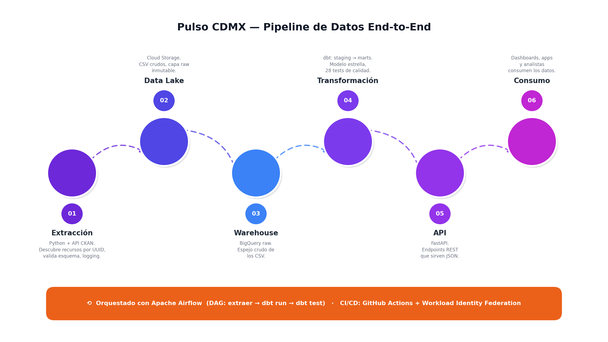

# Pulso CDMX 🚇

**ES** · Pipeline de datos de extremo a extremo (ELT) que ingesta, modela y sirve la afluencia diaria del Metro de la Ciudad de México sobre Google Cloud Platform, **orquestado con Apache Airflow**.

**EN** · End-to-end data pipeline (ELT) that ingests, models and serves the daily ridership of the Mexico City Metro on Google Cloud Platform, **orchestrated with Apache Airflow**.

---

## 🧭 Resumen / Overview

**ES** · Pulso CDMX toma datos públicos de afluencia del Metro (más de 15 años, ~2.3 millones de registros entre dos fuentes) desde el portal de datos abiertos de la CDMX y los convierte en un almacén de datos analítico, limpio y consultable, expuesto a través de una API REST. El proyecto implementa un flujo ELT moderno con extracción automatizada, un data lake, un warehouse modelado en esquema estrella, pruebas de calidad de datos, CI/CD sin llaves, orquestación con Airflow y una capa de servicio.

**EN** · Pulso CDMX takes public Metro ridership data (15+ years, ~2.3M records across two sources) from Mexico City's open data portal and turns it into a clean, queryable analytical warehouse, exposed through a REST API. The project implements a modern ELT flow with automated extraction, a data lake, a star-schema warehouse, data quality tests, keyless CI/CD, Airflow orchestration, and a serving layer.

---

## 🏗️ Arquitectura / Architecture

```
Portal Datos Abiertos CDMX (API CKAN)
        │
        ▼
Extracción · Python           →  descubre recursos vía API, valida esquema, logging
        │
        ▼
Cloud Storage (data lake)     →  CSV crudos, capa raw inmutable
        │
        ▼
BigQuery · raw                →  espejo crudo de los CSV
        │
        ▼
dbt · transformación          →  staging (limpieza) → marts (modelo estrella)
        │                        28 tests + reconciliación cruzada
        ▼
API de consumo · FastAPI      →  endpoints REST, JSON
        │
        ▼
Dashboards · apps · analistas

   ⟲ Orquestación: Apache Airflow (Docker) — DAG: extraer → dbt run → dbt test
   ⟲ CI/CD: GitHub Actions + Workload Identity Federation (keyless)
```



---

## 🛠️ Stack

| Categoría / Category | Tecnologías / Technologies |
|---|---|
| Lenguajes / Languages | Python, SQL |
| Cloud | Google Cloud Platform (Cloud Storage, BigQuery, IAM) |
| Transformación / Transformation | dbt (dbt-core, dbt-bigquery, dbt_utils) |
| Orquestación / Orchestration | Apache Airflow (Docker, LocalExecutor) |
| API | FastAPI, Uvicorn |
| CI/CD | GitHub Actions, Workload Identity Federation |
| Contenedores / Containers | Docker, Docker Compose |
| Extracción / Extraction | requests, CKAN API |
| Control de versiones / Version control | Git, GitHub |

---

## 📦 Componentes / Components

### 1. Extracción / Extraction (`extraccion/`)

**ES** · Script en Python que descarga los CSV de afluencia sin intervención manual:
- Descubre las URLs de descarga dinámicamente vía la **API de CKAN** (usa el UUID del recurso como ancla estable, no la URL — que cambia cada mes).
- Valida el formato y el esquema de columnas antes de subir.
- Sube a Cloud Storage con autenticación **ADC** (sin archivos de llave).
- Diseño parametrizado (`FUENTES` dict): agregar Metrobús o RTP es una entrada más en el diccionario.

**EN** · Python script that downloads the ridership CSVs with no manual intervention: dynamic resource discovery via the CKAN API (UUID as stable anchor), schema validation before upload, keyless auth (ADC), and a parametrized design.

### 2. Data lake + Warehouse (GCS + BigQuery)

**ES** · El lake (Cloud Storage) guarda los CSV crudos como **evidencia inmutable**; el warehouse (BigQuery) guarda las tablas modeladas. Separarlos permite reprocesar desde el origen sin volver a extraer.

**EN** · The lake stores raw CSVs as immutable evidence; the warehouse stores modeled tables. Separation enables reprocessing from source without re-extraction.

### 3. Transformación / Transformation (`dbt/`)

**ES** · Modelo por capas siguiendo la metodología Kimball:
- **staging** — repara la calidad de datos (ver tabla abajo) y normaliza.
- **marts** — modelo estrella con **dimensiones conformadas** (`dim_fecha`, `dim_linea`, `dim_estacion`) y **dos tablas de hechos** (`fact_afluencia_diaria`, `fact_afluencia_tipo_pago`) por sus granos distintos.

**EN** · Layered model (Kimball): staging cleans and normalizes; marts is a star schema with conformed dimensions and two fact tables (distinct grains).

### 4. Orquestación / Orchestration (`airflow/`)

**ES** · **Apache Airflow** (corriendo local con Docker Compose, LocalExecutor) orquesta el pipeline completo como un DAG con dependencias: `extraer → dbt run → dbt test`. Cada tarea espera a que la anterior termine; Airflow maneja el agendado (`@daily`), reintentos, logging y visibilidad de cada corrida. La autenticación con GCP se resuelve montando las credenciales ADC en el contenedor (respetando la política de no-llaves-JSON del proyecto).

**EN** · **Apache Airflow** (local, Docker Compose, LocalExecutor) orchestrates the full pipeline as a DAG with dependencies: `extract → dbt run → dbt test`. Each task waits for the previous one; Airflow handles scheduling, retries, logging and per-run visibility. GCP auth is resolved by mounting ADC credentials into the container.

### 5. Calidad de datos / Data quality

**ES** · 27 tests genéricos (`unique`, `not_null`, `relationships`, `accepted_values`) + 1 test custom de **reconciliación cruzada**: verifica que la suma de la afluencia desglosada por tipo de pago iguale la afluencia total, para cada fecha-línea-estación en el traslape 2021-2026.

**EN** · 27 generic tests + 1 custom cross-reconciliation test verifying that the sum of ridership by payment type equals the total, for every date-line-station in the 2021-2026 overlap.

### 6. CI/CD (`.github/workflows/`)

**ES** · GitHub Actions corre `dbt build` (modelos + tests) en cada push y pull request. Autenticación mediante **Workload Identity Federation** — sin llaves JSON almacenadas.

**EN** · GitHub Actions runs `dbt build` on every push and PR. Auth via Workload Identity Federation — no stored JSON keys.

### 7. API de consumo / Serving API (`api/`)

**ES** · API REST con FastAPI que sirve los datos del modelo estrella como JSON, con documentación interactiva automática en `/docs`. Conexión a BigQuery vía ADC, permisos de solo lectura.

**EN** · FastAPI REST API serving star-schema data as JSON, with auto-generated interactive docs at `/docs`. BigQuery connection via ADC, read-only.

---

## 🔍 Hallazgos de calidad de datos / Data quality findings

**ES** · El perfilado reveló cinco problemas documentados en la fuente. Cada uno se resuelve en la capa correspondiente:

| Problema / Problem | Evidencia / Evidence | Resuelto en / Resolved in |
|---|---|---|
| **Mojibake de doble capa** | `Línea`, `Oceanía` en ambas bases | staging (reemplazos SQL) |
| **Nomenclatura inconsistente en `linea`** | 24 variantes para 12 líneas | staging (canonización) |
| **Mislabeling dic-2020** | Deportivo Oceanía publicada como "Oceanía"; 62 filas afectadas | staging (bandera `calidad_dato`) + test |
| **Granos distintos entre fuentes** | Simple: fecha-línea-estación · Desglosada: +tipo_pago | marts (dos facts) |
| **Actualizaciones retroactivas** | El portal advierte que datos históricos pueden cambiar | Roadmap (merge/upsert) |

**Decisión destacada / Notable decision** — El mislabeling de diciembre 2020 **no era reparable con confianza**: los rangos de afluencia de Oceanía y Deportivo Oceanía se solapan, así que asignar cada fila sería inventar datos. En vez de eliminar o adivinar, las 62 filas se **marcan** con una bandera de calidad. *No borrar, marcar.*

---

## 🧩 Decisiones de diseño / Design decisions

**ES**
- **Dos tablas de hechos, no una** — los granos distintos (con/sin tipo de pago) justifican dos facts con dimensiones conformadas.
- **Raw como espejo crudo** — la capa raw preserva el mojibake; la limpieza vive en staging. Raw es evidencia, no producto.
- **CI/CD sin llaves (WIF)** — más seguro que almacenar una llave JSON en secrets.
- **Airflow local con Docker** — orquestación real sin el costo de Cloud Composer; la lógica del DAG es idéntica y portable a un entorno administrado.

**EN** · Two fact tables for distinct grains; raw kept as an untouched mirror; keyless CI/CD via WIF; local Airflow with Docker (real orchestration, no Composer cost, portable DAG logic).

---

## 🚀 Cómo ejecutar / How to run

```bash
# 1. Extracción / Extraction
cd extraccion
gcloud auth application-default login
python extraer_metro.py

# 2. Transformación / Transformation
cd dbt/pulso_cdmx
dbt build          # corre modelos + tests / runs models + tests

# 3. Orquestación / Orchestration (Airflow)
cd airflow
docker compose up -d
# → http://localhost:8080  (DAG: pipeline_dbt)

# 4. API
cd api
uvicorn api:app --reload
# → http://127.0.0.1:8000/docs
```

---

## 🗺️ Roadmap

**ES**
- Estrategia merge/upsert para las actualizaciones retroactivas del portal.
- Integración de Metrobús, Cablebús y RTP (una entrada más en `FUENTES`).
- Endpoints con parámetros y vistas de consumo (`rpt_`) en dbt.
- Dashboard en Power BI conectado al warehouse.
- Infraestructura como código con Terraform.

**EN** · merge/upsert for retroactive updates · Metrobús, Cablebús & RTP integration · parametrized endpoints · Power BI dashboard · Terraform IaC.

---

## 📊 Fuente de datos / Data source

[Portal de Datos Abiertos de la CDMX](https://datos.cdmx.gob.mx/dataset/afluencia-diaria-del-metro-cdmx) — Afluencia diaria del Metro (API CKAN).

---

*Autor / Author: Jesús Pérez · [github.com/JesusaPerezs/Pulso_CDMX](https://github.com/JesusaPerezs/Pulso_CDMX)*